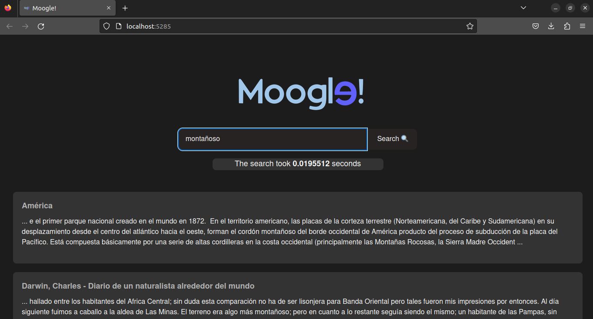
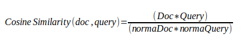

# Informe del Proyecto de Programación Moogle!
***Vladimir Piñera Verdecia C121***

*Estudiante de primer año de Ciencias de la Computación*

## 1. Estructura del Proyecto
### 1.1. Moogle Engine
Cuenta con 8 clases que se encargan del correcto funcionamiento del programa:

- **Moogle**: Cuenta con un método `QueryProcess` (el cual fue modificado) que es el encargado de llevar el flujo de trabajo del programa, es la clase principal.
- **SearchItem**: No se le realizaron cambios. Esta es la clase que se instancia para almacenar los documentos que finalmente se devuelven.
- **SearchResult**: Tampoco se le realizaron cambios. Esta clase es la encargada de devolver los objetos de tipo *SearchItem*.
- **Documents**: En esta clase se procesan los documentos y crea la matriz TF-IDF.
- **Query**: Se encarga del procesamiento de la consulta del usuario y crea el vector.
- **VectorModel**: Dentro de esta clase se realiza el cálculo del score. Se calcula la similitud de cosenos entre el vector de consulta y cada vector de documentos y luego se ordenan descendentemente teniendo en cuenta el valor obtenido.
- **SpanishStemmer**: Clase auxiliar que contiene de una adaptación al español del algoritmo de Porter para aplicarle _stemming_ a las palabras del corpus.
- **Levenshtein**: Clase que contiene el algoritmo de Distancia de Levenshtein recursivo y se usa para buscar la palabra "más similar" a la _no encontrada_ en el corpus.

### 1.2 Moogle Server
Aquí se encuentra el servidor web y la interfaz gráfica de Moogle!. Se le realizaron algunos cambios a los archivos `Index.razor` y `site.css` para mejorar la interfaz gráfica y agregarle algunas funcionalidades como mostrar el tiempo que demora la búsqueda y una sugerencia en caso de que existan pocos o ningún resultado.




## 2. Flujo de ejecución del programa
### 2.1 Clase Documents
Primero se cargan los documentos con el método `LoadDocs` de la clase Documents, esto antes de la primera ejecución del programa, de esta forma se cargan solo una vez:
```cs
Documents.LoadDocs();
app.Run();
```
Este método almacena en arrays los títulos de cada documento, así como su texto y se utiliza un _Hashset_ para almacenar las palabras únicas del mismo (aprovechando el hecho de que un hashset es una colección de elementos únicos). Luego se le aplica el algoritmo de Porter para _Stemming_ a cada palabra del documento llamando al método `StemmingText` quien a su vez llama a la clase _SpanishStemmer_, esto se guarda temporalmente en un array. Después de guardar las palabras en este array se procesan para agregar al array de diccionarios `stemwordFrec` el diccionario correspondiente al documento, el cual almacena cada palabra con su cantidad de apariciones en el documento.
```cs
string[] stemmedwords = StemmingText(words); //Le aplicamos Stemming a las palabras
//Ordenar las palabras del texto para contar luego las repetidas
Array.Sort(stemmedwords);
//Agrupar y contar las palabras repetidas
var groupedWords = stemmedwords.GroupBy(w => w);
Dictionary<string, int> wordCounts = groupedWords.ToDictionary(g => g.´Key, g => g.Count());
//Crear un nuevo hashset a partir del diccionario de counts
HashSet<string> wordSet = new HashSet<string>(wordCounts.Keys);
//Agregar el hashset al array de documentos
stemwordFrec[index] = new Dictionary<string, int>(wordSet.Select(w => new KeyValuePair<string, int>(w, wordCounts[w])));
```
En esta porción de código primero se llama al método `Array.Sort` para ordenar las palabras del texto. Este paso es necesario para poder identificar y contar las palabras repetidas posteriormente. Luego, el método llama a `GroupBy` para agrupar las palabras repetidas por su raíz. Se utiliza una expresión lambda para decir que se desea agrupar por la variable 'w', que representa cada palabra. A continuación, se llama a `ToDictionary` para contar el número de palabras que comparten cada raíz y almacenar esta información en un diccionario. La expresión lambda `g => g.Key` es utilizada para especificar que se desea utilizar la raíz de cada grupo como clave en el diccionario.
Luego, se crea un nuevo hashset a partir de las claves del diccionario de conteo de palabras. Esto asegura que sólo se almacenan palabras únicas en el hashset. Finalmente, el hashset se agrega al array de diccionarios como clave y su 'count' como valor (esto será esencial para calcular el _TF_ ). Este proceso completo se realiza iterativamente por cada documento, utilizando la técnica del _Parallel ForEach_ para procesar los documentos en paralelo. Al salir del ciclo se llama a `IDFCorpus` que calcula el _Inverse Document Frequency_ (IDF) de cada palabra del corpus. El IDF mide la rareza de un término y se calcula: 


>N -> Cantidad total de documentos

>n -> Cantidad de documentos en los que aparece el término

El método `CreateTF_IDF_Matrix` se llama a continuación y se encarga de crear la matriz término-documento representada por un array de diccionarios (cada diccionario representa el vector de un documento, o sea cada fila de la matriz es un documento). Dentro del método se calcula una variación del _Term Frequency_ que se conoce como: _Frecuencia Normalizada de Términos_ que mide la frecuencia de un término en el documento y se calcula:


>c -> cantidad de veces que se repite el término en el documento

>C -> cantidad de veces que se repite el término más frecuente en el documento

Luego se multiplican los valores de TF y de IDF de cada palabra en su respectivo documento, se almacena finalmente en `CreateTF_IDF_Matrix` y se le aplica la _Normalización Euclidiana_ a cada vector.

### 2.2 Clase Query
Luego de la carga de documentos, viene la consulta del usuario. Dentro del método `QueryProcess(string query)` de la clase _Moogle_ se crea la instancia de la clase _Query_ la cual es la encargada de procesar la consulta y su funcionamiento se explicará detalladamente a continuación.
    
En el constructor de la clase se divide el texto de la consulta en palabras y se buscan posibles operadores en la misma haciendo un llamado al método `AnyOperator` el cual, en caso de encontrar los operadores '!' o '^'  (el operador '\*' se comprueba luego por separado).
Luego se itera a través del array que contiene el texto dividido, se le aplica el Algoritmo de Porter para Stemming a cada palabra, así como también se almacenan en el diccionario `queryVector` las palabras únicas (con stemming) con su frecuencia en la consulta.
En caso de que una palabra no aparezca en el corpus de documentos, se busca la más similar a ella haciendo un llamado al método `SimilarWord` que a su vez se apoya en la clase `Levenshtein` que utiliza el algoritmo del mismo nombre para medir qué tan similares son dos palabras. De esta forma se obtiene la palabra "más cercana" a la ingresada por el usuario y se añade a `suggestion`, variable estática de la clase _Moogle_.
```cs
    public static string SimilarWord(string NotFound)
    {
        string similar = "";
        int shortestDistance = int.MaxValue;
        foreach (var diccionarios in Documents.wordsinText)
        {
            foreach (var word in diccionarios)
            {
                int distance = Levenshtein.DistanciaLev(NotFound, word);
                if (distance < shortestDistance)
                {   //Se guarda la menor distancia entre la palabra no encontrada y las palabras del corpus
                    shortestDistance = distance;
                    similar = word;
                }
            }
        }
        if (String.IsNullOrEmpty(similar)) return "";
        return similar;
    }
```
Por último se llama al método `QueryProcessed` que se encarga de crear el vector de la query `queryVector`, en este caso se sobreescribe con el valor TF-IDF el valor almacenado en el diccionario (anteriormente almacenaba la frecuencia del término) de esta forma se optimiza el uso de memoria. El valor de TF-IDF se multiplica por 2 elevado a k, siendo k la cantidad de veces que aparece el operador de importancia en la palabra (en caso de no existir k sería igual a 0 y se multiplicaría el TF-IDF por 1). Luego se le aplica la _Normalización Euclidiana_ para normalizar los valores del vector.

### 2.3 Clase VectorModel
Al terminar con el procesamiento de la consulta, en el método `QueryProcess(string query)` de la clase _Moogle_ se crea la instancia de la clase _VectorModel_ la cual recibe como parámetro el vector de la consulta. En el constructor de la clase _VectorModel_ se itera sobre la matriz de documentos y se llama al método `RelevantDoc` pasándole como parámetro el vector del documento por el que va la iteración. Este método devuelve un true si el documento es válido y devuelve false si no lo es. Un documento se considera no válido cuando incumple con alguna condición que imponen los operadores (en caso de que su utilicen) o si no contiene ninguna palabra de la consulta.
```cs
    private static bool RelevantDoc(Dictionary<string,double> docTFIDF){
        string[] querykeys = query.Keys.ToArray();
        if (Query.requireoperator.Item1){
            for (int i = 0; i < Query.requireoperator.Item2.Count; i++)
            {
                if(!docTFIDF.ContainsKey(querykeys[Query.requireoperator.Item2[i]])) return false;
            }
        }
        if (Query.excludeoperator.Item1){
            for (int i = 0; i < Query.excludeoperator.Item2.Count; i++)
            {
                if(docTFIDF.ContainsKey(querykeys[Query.excludeoperator.Item2[i]])) return false;
            }
        }
        if(!Query.requireoperator.Item1 && !Query.excludeoperator.Item1) {
            foreach (KeyValuePair<string, double> word in query)
            {
                //Si contiene al menos una palabra de la query y esta tiene tf-idf mayor que 0.05 (o sea no es una stopword) el documento es válido
                if(docTFIDF.ContainsKey(word.Key) && word.Value > 0.05) return true;
            }       
            return false;
        }
        return true;
    }
```
De esta forma se analizan solo los documentos válidos (o sea que el resto tienen score = 0). En caso de que sea válido se continúa en esa iteración y se calcula la _Similitud de Cosenos_ entre el vector del documento y el vector de la consulta. La similitud de cosenos es una medida utilizada para determinar la similitud entre dos documentos, en otras palabras, mide la similitud de las direcciones en las que apuntan los vectores, en lugar de medir la distancia entre ellos. Cuanto más cercanos estén los vectores, mayor será la similitud de cosenos y su fórmula es:


>Doc -> vector documento

>Query -> vector consulta

>'\*' Representa el producto escalar

>normaDoc -> Raíz cuadrada del producto escalar del vector documento por sí mismo

>normaQuery -> Raíz cuadrada del producto escalar del vector consulta por sí mismo

Luego de calcular la similitud se comprueba si el documento contiene alguna palabra exacta (sin stemming aplicado) a la que ingresó el usuario (para eso se guardaron las palabras sin stemming en la variable `wordsinText` de la clase _Documents_). En caso de que contenga alguna palabra se multiplica por 10 el valor del score, mientras más palabras exactas contenga el documento, mayor será su score.
Lo próximo que se realiza es guardar en la variable Score (que es una lista de tuplas, donde cada tupla contiene el score del documento y el índice del mismo para poder devolverlo correctamente). Por último se ordenan descendientemente de esta forma:
```cs
    Score = Score.OrderByDescending(x => x.Item1).ToList();
```
### 2.4 Preparación de los documentos a devolver en la clase Moogle
Cuando ya se tienen los documentos relevantes ordenados por score le asignamos un tamaño al array `items` de tipo _SearchItem_ y al array que almacenará los snippets. Este tamaño es el mínimo entre 10 y la cantidad de documentos encontrados, de esta forma se evitará devolver demasiados documentos. Luego se elabora el snippet para cada documento y se añade a `items` los objetos _SearchItem_ que contienen el título del documento, un snippet y el score correspondiente.
```cs
    public static string CreateSnippet(int indexDoc, Dictionary<string, double> query)//Este metodo elabora el snippet 
    {
        string text = DocText[indexDoc];
        int middle = -1;
        int SnipLeng = 500;

        foreach (var word in query)
        {
            if (word.Value < 0.05) continue; //Esto para evitar que arme el snippet alrededor de alguna stopword 
            middle = text.IndexOf(word.Key); //Buscamos el índice de la palabra en el texto

            if (middle >= 0)
            {
                if (text.Length <= SnipLeng) //Si el texto tiene menos de 500 caracteres se devuelve el texto entero
                    return text;
                if (text.Length - middle <= SnipLeng)
                    return text.Substring(middle, text.Length - middle);

                if (middle < 250)
                    return text.Substring(0, SnipLeng);
                else
                    return text.Substring(middle - 250, SnipLeng);
            }
        }
        return text.Substring(0, 500);
    }
```
Después se comprueba si hay más de 5 resultados para en ese caso no mostrar sugerencia alguna.
Por último el método devuelve un objeto `SearchResult` con el array `items` y la sugerencia.

Terminados todos estos procesos se mostrarán los resultados en la web